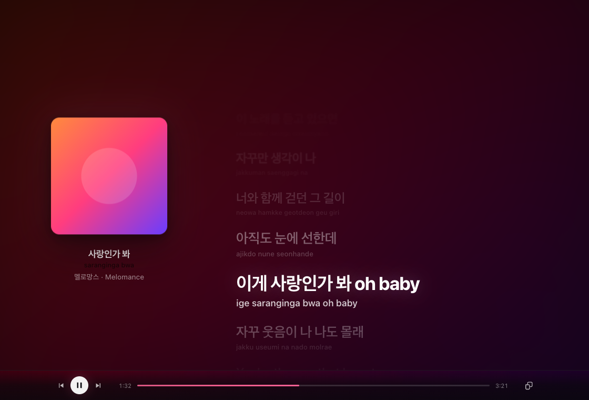
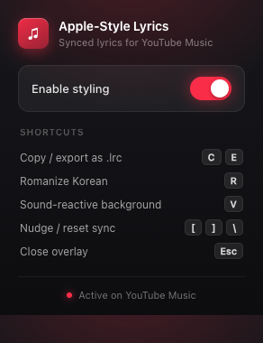

# YT Music Lyrics

Apple Music–style **synced lyrics** overlaid on [music.youtube.com](https://music.youtube.com) — full-screen, word‑by‑word timing when available, with the background tinted from the album art.

> Chrome Extension (Manifest V3), vanilla JavaScript — no build step, no bundler, no dependencies.



<sub>Design preview, rendered from the real `lyrics.css`; album art and lyrics shown are placeholders.</sub>

## Features

- **Synced lyrics** — line- and word-level (karaoke-style) timing, scrolled in lockstep with playback.
- **Multiple sources with fallback** — Binimum (Apple Music TTML) → Musixmatch → lrclib.net → Cubey. First hit wins and is cached per song. Wrong-song matches are rejected by title+artist verification.
- **🇰🇷 Korean romanization** — a romanized reading under each Hangul line (Revised Romanization with the common assimilation rules: 받침 liaison, palatalization, silent ㅎ, nasalization, liquidization (신라→*silla*), double-batchim liaison (읽어→*ilgeo*), and ㅎ-aspiration (좋다→*jota*)). Toggle with **R**.
- **Sound-reactive background** — the blurred album backdrop gently pulses with the music. Toggle with **V**.
- **Album-accent theming** — a color sampled from the cover tints the active-line glow, album halo, and controls.
- **Controls** — click a line to seek, drag the progress bar, copy lyrics, **export synced lyrics as `.lrc`**, adjust text size, nudge sync offset per song.

## Install (unpacked)

There is no build step — load the folder directly:

1. Open `chrome://extensions`.
2. Enable **Developer mode** (top right).
3. Click **Load unpacked** and select this directory.
4. Open [music.youtube.com](https://music.youtube.com), play a song, and open the lyrics panel. The overlay appears automatically.

Click the toolbar icon to toggle the extension on/off; the popup also lists the in-overlay shortcuts. After editing any file, click the reload icon on the extension card.



## Keyboard shortcuts (while the overlay is open)

| Key | Action |
|-----|--------|
| `Esc` | Close the overlay |
| `[` / `]` | Nudge sync offset earlier / later (per song, saved) |
| `\` | Reset sync offset |
| `C` | Copy lyrics to clipboard |
| `E` | Export synced lyrics as an `.lrc` file |
| `−` / `+` | Decrease / increase text size (saved) |
| `V` | Toggle the sound-reactive background |
| `R` | Toggle Korean romanization |
| `Shift`+`D` | Toggle the debug HUD |

## How it works

Two content scripts run in different JS worlds and talk over `window.postMessage`:

- **`content.js`** (ISOLATED world) — lyric fetching, parsing, the sync engine, and the overlay UI.
- **`playerBridge.js`** (MAIN world) — the only code that can read YouTube Music's `movie_player` API; posts interpolated playback time every 20 ms.

Word-level highlighting is CSS-driven (per-word `animation-delay` scrubbing), so the compositor does the work rather than per-frame JavaScript. See `AGENTS.md` for the deep dive.

## Troubleshooting

- **The overlay doesn't appear.** Make sure you're on **music**.youtube.com (not regular youtube.com), a song is actually playing, and you've opened the song's lyrics panel — the overlay opens from there. If you just edited the code, click the reload icon on the extension card in `chrome://extensions`.
- **Wrong song's lyrics.** The extension checks that a result's title **and** artist loosely match what's playing and rejects mismatches, but an obscure or mislabelled track can still slip through. It re-runs on every song change, so skipping away and back usually clears it; you can also nudge with a manual search upstream. Sync offset is per-song (`[` / `]`, reset `\`).
- **Lyrics take a moment to load.** Sources are tried in order (Binimum → Musixmatch → lrclib → Cubey) and each has a hard timeout, so a slow or missing source falls through rather than hanging. Results are cached per song, so returning to a track is instant.
- **The sound-reactive background isn't moving.** Web Audio needs a user gesture to start — click anywhere in the page once — and the effect is toggled with **V**.
- **Romanization isn't showing.** Press **R**; a romanized reading appears under each Korean line (and the title).
- **Nothing updates after I change a file.** Reload the extension (`chrome://extensions` → reload icon), then reload the YouTube Music tab.

## Privacy

The extension sends the **song title, artist, and duration** to the lyric providers above to look up lyrics, and reads the current track/time from the YouTube Music player. It stores small preferences locally (sync offset, text size, toggles, and a cached Musixmatch/Cubey token). No analytics, no accounts, no data sent anywhere else.

## Development

No toolchain required.

```bash
npm test                 # zero-dependency parser/sync tests (Node's built-in node:test)
node --check content.js  # syntax check
```

Design changes can be previewed without loading the extension: serve the repo over HTTP (`python3 -m http.server`) and open `preview/preview.html` — it renders the overlay with mock lyrics and the real `lyrics.css`. `?theme=warm|cool|mono|dark` and `?roman=1` help check the look across covers.

`content.js` and `playerBridge.js` are **ES5-only** (no transpiler). See `CLAUDE.md` / `AGENTS.md` for conventions.

## Credits

Lyrics from [Binimum](https://binimum.org), [Musixmatch](https://www.musixmatch.com), [lrclib.net](https://lrclib.net), and Cubey. Not affiliated with or endorsed by Google, YouTube, or Apple.
